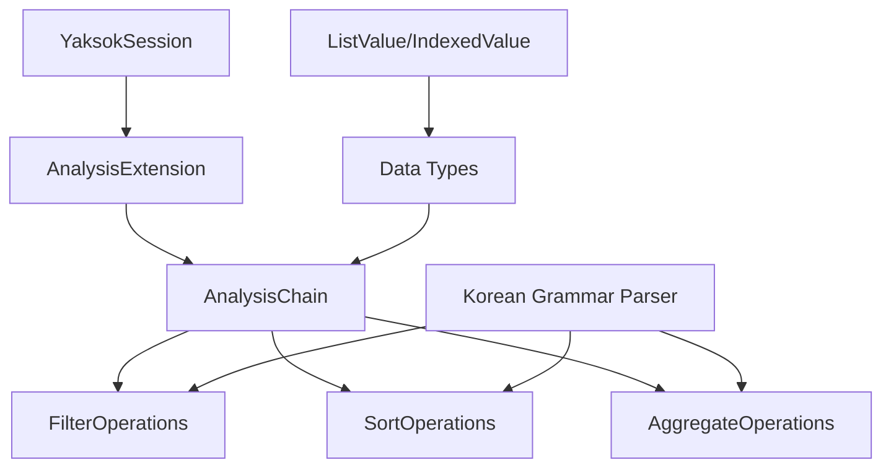

# Design Document

## Overview

한국어 자연어 문법을 사용하여 데이터 분석을 수행할 수 있는 라이브러리를
설계합니다. 이 라이브러리는 Dalbit Yaksok의 Extension 시스템을 활용하여
구현되며, 체이닝 방식으로 동작하는 함수들을 제공합니다.

핵심 아이디어는 다음과 같은 자연스러운 한국어 문장을 코드로 작성할 수 있게 하는
것입니다:

```yak
결과 = 번역(분석), (거래내역)중 '금액'이 5000보다 큰것 중 가장많이나온 '이름'
***
return 거래내역중('금액이 5000보다 큰것').중('가장많이나온 이름')
***
```

## Architecture

### 전체 구조



### 핵심 컴포넌트

1. **AnalysisExtension**: Dalbit Yaksok Extension 인터페이스 구현
2. **AnalysisChain**: 체이닝 가능한 데이터 분석 객체
3. **KoreanGrammarParser**: 한국어 조사 변화 처리
4. **FilterOperations**: 필터링 함수들 (큰것, 작은것, 인것, 들어가있는것)
5. **SortOperations**: 정렬 함수들 (정렬한것)
6. **AggregateOperations**: 집계 함수들 (가장많이나온것)

## Components and Interfaces

### AnalysisExtension

```typescript
export class AnalysisExtension implements Extension {
    manifest: ExtensionManifest = {
        ffiRunner: {
            runtimeName: '분석',
        },
    }

    executeFFI(code: string, args: FunctionInvokingParams): ValueType {
        // code는 *** 블록 안의 JavaScript 코드
        // args는 함수 호출 시 전달된 매개변수들
        // 예: (거래내역)중 '금액'이 5000보다 큰것 중 가장많이나온 '이름'
        //     -> args.거래내역이 데이터, 나머지는 함수명에서 파싱
    }
}
```

### AnalysisChain

```typescript
export class AnalysisChain extends ObjectValue {
    constructor(private data: ListValue) {
        super()
    }

    // 체이닝 메서드들
    중(condition: string): AnalysisChain
    을_를(field: string): AnalysisChain
    로_으로(field: string): AnalysisChain

    // 최종 결과 메서드들
    가장많이나온것(field: string): ValueType
}
```

### KoreanGrammarParser

```typescript
export class KoreanGrammarParser {
    // 조사 변화 처리
    static parseParticle(
        word: string,
        particle: '이/가' | '을/를' | '로/으로',
    ): string

    // 함수명 파싱
    static parseFunction(expression: string): {
        functionName: string
        field: string
        value?: any
        operator?: string
    }
}
```

## Data Models

### 입력 데이터 형식

분석 라이브러리는 다음과 같은 형태의 데이터를 처리합니다:

```typescript
// ListValue 형태의 데이터 (각 항목은 IndexedValue)
;[
    { 이름: '김철수', 금액: 5000, 결제수단: '카드', 일자: '2024-01-01' },
    { 이름: '이영희', 금액: 3000, 결제수단: '현금', 일자: '2024-01-02' },
    // ...
]
```

### 함수 시그니처

1. **필터링 함수들**
    - `중 '필드명'이/가 값보다 큰것`: 숫자 비교 (>)
    - `중 '필드명'이/가 값보다 작은것`: 숫자 비교 (<)
    - `중 '필드명'이/가 값인것`: 정확한 일치 (===)
    - `중 '필드명'에 값이/가 들어가있는것`: 문자열 포함 (includes)

2. **정렬 함수**
    - `을/를 '필드명'로/으로 정렬한것`: 오름차순 정렬

3. **집계 함수**
    - `가장많이나온 '필드명'`: 최빈값 반환

## Error Handling

### 에러 타입

1. **InvalidDataFormatError**: 잘못된 데이터 형식
2. **FieldNotFoundError**: 존재하지 않는 필드 참조
3. **InvalidOperatorError**: 잘못된 연산자 사용
4. **GrammarParseError**: 한국어 문법 파싱 오류

### 에러 처리 전략

```typescript
try {
    const result = analysisChain.중('금액이 5000보다 큰것')
} catch (error) {
    if (error instanceof FieldNotFoundError) {
        // 필드명 제안 로직
    } else if (error instanceof GrammarParseError) {
        // 문법 교정 제안
    }
    throw error
}
```

## Testing Strategy

### 단위 테스트

1. **KoreanGrammarParser 테스트**
    - 조사 변화 처리 정확성
    - 함수명 파싱 정확성

2. **AnalysisChain 테스트**
    - 각 필터링 함수의 동작
    - 체이닝 동작 검증
    - 데이터 타입 변환

3. **AnalysisExtension 테스트**
    - FFI 인터페이스 구현
    - 에러 처리

### 통합 테스트

1. **전체 워크플로우 테스트**

    ```yak
    번역(분석), (데이터)중 '금액'이 3000보다 큰것 중 가장많이나온 '이름'
    ***
    return 데이터중('금액이 3000보다 큰것').중('가장많이나온 이름')
    ***

    거래내역 = [
        {"이름": "김철수", "금액": 5000, "결제수단": "카드"},
        {"이름": "이영희", "금액": 3000, "결제수단": "현금"}
    ]

    결과 = (거래내역)중 '금액'이 3000보다 큰것 중 가장많이나온 '이름'
    ```

2. **복잡한 체이닝 테스트**

    ```yak
    번역(분석), (데이터)중 '결제수단'가 '카드'인것 중 '금액'이 100보다 큰것을 '일자'로 정렬한것
    ***
    return 데이터중('결제수단이 카드인것').중('금액이 100보다 큰것').을('일자로 정렬한것')
    ***

    결과 = (거래내역)중 '결제수단'가 '카드'인것 중 '금액'이 100보다 큰것을 '일자'로 정렬한것
    ```

### 성능 테스트

- 대용량 데이터셋에서의 필터링 성능
- 체이닝 오버헤드 측정
- 메모리 사용량 최적화

## Implementation Details

### 함수 등록 방식

Dalbit Yaksok의 번역 문법을 사용합니다:

```yak
번역(분석), (데이터)중 '필드명'이/가 값보다 큰것
***
return 데이터중('필드명이 ' + 값 + '보다 큰것')
***

번역(분석), (데이터)중 '필드명'이/가 값보다 작은것
***
return 데이터중('필드명이 ' + 값 + '보다 작은것')
***

번역(분석), (데이터)중 '필드명'이/가 값인것
***
return 데이터중('필드명이 ' + 값 + '인것')
***

번역(분석), (데이터)중 '필드명'에 값이/가 들어가있는것
***
return 데이터중('필드명에 ' + 값 + '이 들어가있는것')
***

번역(분석), (데이터)를 '필드명'로/으로 정렬한것
***
return 데이터를('필드명으로 정렬한것')
***

번역(분석), (데이터)중 가장많이나온 '필드명'
***
return 데이터중('가장많이나온 ' + 필드명)
***
```

AnalysisExtension의 executeFFI에서는 JavaScript 코드를 실행하고 적절한 분석
함수를 호출합니다:

```typescript
executeFFI(code: string, args: FunctionInvokingParams): ValueType {
    // code는 "return 데이터중('필드명이 값보다 큰것')" 형태
    // args에는 함수 호출 시 전달된 매개변수들이 포함됨

    const analysisChain = new AnalysisChain(args.데이터 as ListValue)

    // JavaScript 코드 실행하여 분석 수행
    const result = eval(code.replace('return ', ''))

    return result
}
```

### 체이닝 구현

각 함수는 새로운 AnalysisChain 인스턴스를 반환하여 불변성을 보장합니다:

```typescript
중(condition: string): AnalysisChain {
    const filteredData = this.data.filter(item => {
        // 조건 평가 로직
    })
    return new AnalysisChain(new ListValue(filteredData))
}
```

### 한국어 조사 처리

받침 유무에 따른 조사 변화를 자동으로 처리합니다:

```typescript
static parseParticle(word: string, particle: '이/가' | '을/를' | '로/으로'): string {
    const hasJongseong = this.hasJongseong(word)

    switch (particle) {
        case '이/가': return hasJongseong ? '이' : '가'
        case '을/를': return hasJongseong ? '을' : '를'
        case '로/으로': return hasJongseong ? '으로' : '로'
    }
}
```
