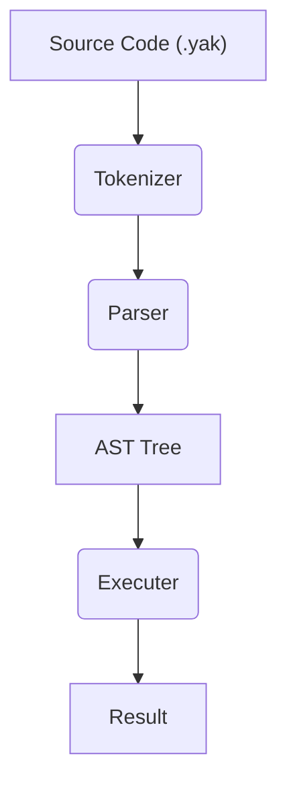

# 2. 전체 아키텍처: 코드 한 줄의 여정

이제 컴퓨터에서 '달빛 약속' 코드를 실행할 준비가 끝났습니다. 그렇다면 우리가 작성한 코드는 어떤 과정을 거쳐 컴퓨터가 이해하고 실행하는 결과물로 바뀌는 걸까요? 이번 장에서는 '달빛 약속'의 심장부를 이루는 핵심적인 처리 과정을 높은 수준에서 살펴보겠습니다.

우리가 작성한 `.yak` 파일 속의 코드는 마치 공장의 생산 라인과 같은 파이프라인을 통과합니다. 각 단계는 이전 단계의 결과물을 입력으로 받아, 다음 단계를 위한 결과물을 만들어냅니다.

이 전체 과정을 다이어그램으로 표현하면 다음과 같습니다.

조금 복잡해 보이나요? 괜찮습니다. 각 단계가 무엇을 하는지 하나씩 살펴봅시다.

### 1. 토크나이저 (Tokenizer)

-   **입력**: `결과 = 10 + 20` 과 같은 순수한 문자열 형태의 코드
-   **출력**: 의미를 가진 가장 작은 단위인 **토큰(Token)** 의 목록

가장 먼저, 토크나이저는 코드 문자열을 `결과`, `=`, `10`, `+`, `20` 처럼 의미 있는 조각으로 잘게 나눕니다. 이 조각 하나하나를 '토큰'이라고 부릅니다. 마치 우리가 문장을 읽을 때 단어 단위로 끊어 읽는 것과 비슷합니다. 이 단계가 없다면 컴퓨터는 코드 전체를 의미 없는 긴 글자로만 인식할 것입니다.

### 2. 파서 (Parser)

-   **입력**: 토큰의 목록
-   **출력**: 코드의 문법 구조를 나무 형태로 표현한 **추상 구문 트리 (AST)**

토크나이저가 단어를 만들었다면, 파서는 이 단어들을 조합하여 문법에 맞는 문장을 만듭니다. 파서는 토큰 목록을 쭉 훑으며 `10 + 20` 이라는 연산이 `결과` 라는 변수에 할당되는 구조라는 것을 파악합니다. 그리고 이 구조를 컴퓨터가 이해하기 쉬운 나무 형태의 자료구조, 즉 **추상 구문 트리(Abstract Syntax Tree, AST)** 로 만듭니다.

### 3. 실행기 (Executer)

-   **입력**: 추상 구문 트리 (AST)
-   **출력**: 최종 실행 결과

마지막으로, 실행기는 파서가 만들어준 AST를 위에서부터 아래로 순회하며 실제 작업을 수행합니다. 나무의 각 가지(Node)를 방문하며, '덧셈을 하라', '변수에 값을 저장하라', '화면에 글자를 출력하라' 와 같은 명령을 실제로 실행합니다. 이 과정을 거치면 드디어 우리가 원하는 결과값이 나오게 됩니다.

---

지금 당장 이 모든 것을 완벽하게 이해하지 않아도 괜찮습니다. 앞으로 이어질 문서들에서 각 단계를 훨씬 더 자세하게, 실제 코드와 함께 살펴볼 예정이니까요.

가장 중요한 것은 **"코드는 토큰 -> AST -> 결과물 순서로 처리된다"** 는 큰 흐름을 기억하는 것입니다. 이제 다음 장부터는 이 파이프라인의 첫 번째 단계인 `core` 모듈의 세계로 들어가 보겠습니다.
