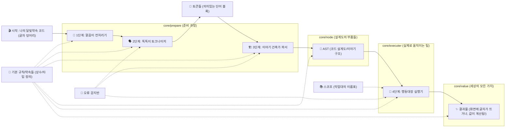

# 달빛약속의 심장부 엿보기: `core/` 디렉토리 탐험 🧭

달빛약속 프로젝트의 [전체 지도](../CONTRIBUTING_GUIDE.md#우리-프로젝트-이렇게-생겼어요--코드베이스-둘러보기)에서 가장 핵심적인 지역, 바로 `core/` 디렉토리에 오신 것을 환영합니다! 🎉 이곳은 달빛약속 언어가 실제로 살아 숨 쉬게 하는 마법이 일어나는 곳이에요. 우리가 작성한 한국어 코드가 어떻게 컴퓨터가 이해하는 명령으로 바뀌고, 또 어떻게 우리가 원하는 결과를 만들어내는지, 그 비밀을 함께 파헤쳐 볼까요?

이 안내서는 `core/` 디렉토리가 어떤 목표를 가지고 있고, 그 안의 주요 부품들(컴포넌트라고도 해요!)이 어떻게 서로 협력해서 달빛약속을 움직이는지에 대한 큰 그림을 그려드릴 거예요. 너무 자세한 기술 이야기보다는, 각 부품이 어떤 역할을 하는지에 초점을 맞춰서 재미있게 설명해 드릴게요! 😉

## `core/` 디렉토리의 꿈: 우리가 만들고 싶은 것 🌟

`core/` 디렉토리 팀원들(?)은 이런 멋진 목표를 가지고 일하고 있어요:

*   **"달빛약속 코드를 척척 알아듣고, 착착 실행하기!"**: 우리가 한국말로 편하게 작성한 달빛약속 코드를 컴퓨터가 정확하게 이해하고, 우리가 시킨 일들을 빈틈없이 수행하도록 하는 것이 가장 중요해요.
*   **"누구나 쉽게 이해하고, 함께 발전시키기!"**: 코드 내부가 너무 복잡하면 새로운 기능을 추가하거나 기존 기능을 개선하기 어렵겠죠? 그래서 `core/` 디렉토리는 각 부품들이 자기 역할을 분명히 하고, 서로 너무 얽히지 않도록 깔끔하게 정리되어 있어요. 덕분에 여러분 같은 멋진 기여자분들이 달빛약속을 함께 키워나가기 좋답니다!
*   **"튼튼하고 빠르게! 안정성과 효율성은 기본!"**: 달빛약속이 언제 어디서든 믿음직하게 작동하고, 너무 느려서 답답하지 않도록 만드는 것도 우리의 중요한 임무예요.

## 달빛약속 코드의 여정: 한 편의 드라마처럼! 🎬

우리가 `보여주기 "안녕, 달빛약속!"` 같은 코드를 한 줄 딱! 작성하면, `core/` 디렉토리 안에서는 어떤 일들이 순서대로 펼쳐질까요? 마치 한 편의 드라마 주인공처럼, 우리 코드가 겪게 될 여정을 따라가 봅시다!

자, 각 단계를 조금 더 자세히 살펴볼까요?

1.  **🎬 시작: 나의 달빛약속 코드 (글자 덩어리)**
    *   모든 것은 우리가 작성한 달빛약속 코드, 즉 순수한 글자들의 나열에서 시작해요.
2.  **🧹 1단계: 깔끔이 전처리기 (`core/prepare/tokenize/index.ts`의 `preprocess` 친구)**
    *   본격적인 분석 전에 코드를 살짝 다듬어주는 역할을 해요. 예를 들어, 윈도우에서 쓰는 줄바꿈(\r\n)이나 옛날 맥에서 쓰던 줄바꿈(\r)을 모두 요즘 표준 줄바꿈(\n)으로 통일해서 다음 단계 친구들이 헷갈리지 않게 해주죠.
3.  **🗣️ 2단계: 똑똑이 토크나이저 (`core/prepare/tokenize/` 탐험대)**
    *   이제 글자 덩어리를 의미 있는 단어들로 쪼개는 시간이에요! 이 똑똑이 친구는 마치 우리가 글을 읽을 때 단어 단위로 끊어 읽는 것처럼, 코드를 `만약`, `나의변수`, `+`, `100`, `"안녕"` 같은 작은 조각들, 즉 **토큰(Token)**으로 나눠요.
    *   각 토큰에는 "이건 키워드야!", "이건 변수 이름이네!" 하는 꼬리표(타입)와 실제 내용(값), 그리고 코드 어디쯤에 있었는지 위치 정보가 붙는답니다.
    *   더 궁금하다면? [토크나이저: 코드의 첫인상, 단어 쪼개기 마법사](./tokenizer.md)에서 자세히 알려줄 거예요!
4.  **🏗️ 3단계: 이야기 건축가 파서 (`core/prepare/parse/` 탐험대)**
    *   토큰이라는 단어들이 모였으니, 이제 이걸로 문장을 만들고 전체 이야기의 구조를 짜야겠죠? 파서가 바로 그 일을 하는 건축가예요!
    *   파서는 토큰들을 문법 규칙에 맞춰서 차곡차곡 쌓아 올려, 코드 전체의 논리적인 구조를 나타내는 **AST(Abstract Syntax Tree, 추상 구문 트리)**라는 멋진 설계도를 만들어요. 나무처럼 생겼다고 해서 트리(Tree)라고 부른답니다. 🌳
    *   달빛약속은 우리가 코드를 쓸 때 중괄호 `{}` 대신 들여쓰기로 이야기의 단락을 나누는 방식을 좋아해요. 파서는 이 들여쓰기도 아주 중요하게 생각한답니다! 또, 가끔은 "이런 함수가 새로 생겼으니, 앞으로 이렇게 생긴 호출은 이 함수를 부르는 걸로 알아들어야 해!" 하고 스스로 규칙을 만들기도 하는(동적 파싱 규칙) 똑똑한 면도 있어요.
    *   파서 건축가의 비밀이 궁금하다면? [파서: 단어들로 문장 만들기, 이야기 건축가](./parser.md)를 방문해보세요!
5.  **🌳 AST (코드 설계도/이야기 구조 - `core/node/` 친구들)**
    *   드디어 완성된 코드 설계도예요! 이 설계도는 여러 종류의 작은 부품(AST 노드)들로 이루어져 있어요. "만약"이라는 조건을 나타내는 부품, 숫자나 글자를 나타내는 부품, 함수(약속)를 부르는 부품 등등 아주 다양하죠.
    *   모든 부품들은 `Node`라는 큰 형님을 부모로 두고 있고, 그중에서도 실제로 뭔가 일을 하는 부품은 `Executable`, 값을 만들어내는 부품은 `Evaluable`이라는 이름표를 추가로 달고 있어요.
    *   어떤 부품들이 있는지 궁금하다면? [AST 노드: 코드의 설계도, 레고 블록 친구들](./ast_nodes.md)에서 구경할 수 있어요!
6.  **🏃 4단계: 행동대장 실행기 (`core/executer/` 탐험대)**
    *   이제 설계도도 나왔겠다, 실제로 코드를 움직여 볼 시간이에요! 실행기는 AST 설계도를 보고 각 부품(노드)에 적힌 대로 "너는 이 일을 해!", "너는 저 값을 가져와!" 하고 명령을 내리는 행동대장이랍니다.
    *   실행기는 **스코프(Scope)**라는 마법의 작업대를 사용해서, "나의변수"라는 이름표에는 어떤 값이 들어있는지, "인사하기"라는 약속은 어디에 있는지 기억하고 관리해요.
    *   가끔 "이제 함수 끝났으니 원래 자리로 돌아가!" (`ReturnSignal`) 하거나 "반복문 그만!" (`BreakSignal`) 같은 특별 지시도 처리해야 하죠.
    *   행동대장의 활약이 보고 싶다면? [실행기: 설계도를 따라 실제로 움직여요!](./executer.md)로 출발!
7.  **✨ 결과물 (화면에 글자가 뜨거나, 값이 계산됨! - `core/value/` 친구들)**
    *   실행기의 지휘에 따라 모든 작업이 끝나면, 드디어 우리가 원하는 결과가 나타나요! 화면에 글자가 출력되거나, 복잡한 계산이 끝나 새로운 값이 만들어지죠. 이 모든 결과물, 즉 달빛약속 세계의 모든 데이터들은 `ValueType`이라는 이름표를 가진 특별한 객체로 표현된답니다. 숫자, 글자, 목록, 심지어 우리가 만든 약속(함수)까지도요!
    *   달빛약속 세계에는 어떤 값들이 살고 있는지 궁금하다면? [값 시스템: 달빛약속 세계의 모든 것들](./values.md)에서 만나보세요!

## `core/` 디렉토리의 또 다른 보물들 💎

위에서 설명한 드라마의 주인공들 외에도, `core/` 디렉토리에는 여러 조력자 친구들이 함께 하고 있어요.

*   **`constant/`**: 달빛약속의 중요한 약속들(예약어), 변하지 않는 값(상수), "이 기능은 켤까, 말까?" 하는 설정(기능 플래그) 등을 모아둔 곳이에요.
*   **`error/`**: 우리가 코드를 잘못 쓰거나, 실행 중에 문제가 생겼을 때 "앗, 이런 문제가 생겼어요!" 하고 친절하게 알려주는 오류 메시지들을 만드는 곳이죠. 😥 (하지만 오류는 성장의 밑거름이랍니다!)
*   **`session/`**: 달빛약속 코드가 실행되는 전체 과정을 관리하거나, 여러 파일에 걸쳐 작업할 때 필요한 정보들을 기억해두는 매니저 같은 역할을 할 수 있어요.
*   **`type/`**: 코드 안에서 "이건 이런 모양의 데이터야" 하고 약속하는 특별한 타입 정의들(예: 코드 위치를 나타내는 `Position`, 코드 파일 정보를 담는 `CodeFile`)이 모여있어요.
*   **`util/`**: 여러 곳에서 도움이 될 만한 만능 도구 함수들을 모아둔 창고예요.
*   **`mod.ts`**: `core/` 디렉토리의 대문 같은 파일이에요! `core/` 안의 중요한 기능이나 타입들을 다른 동네(다른 패키지나 테스트 코드)에서도 쉽게 쓸 수 있도록 "이것들 가져다 쓰세요~" 하고 알려주는 역할을 하죠. (Deno 프로젝트에서 흔히 볼 수 있는 약속이랍니다!)

## `core/` 탐험가를 위한 작은 팁 🗺️

`core/` 디렉토리의 코드를 직접 고치거나 새로운 기능을 더하고 싶으신 용감한 탐험가라면, 이 몇 가지만 기억해주세요!

*   **"나비효과를 생각해요!"**: 작은 수정이라도, 이 드라마의 다른 배우들(컴포넌트들)에게 어떤 영향을 줄지 한번 더 생각해보면 좋아요. 특히 바로 앞뒤 단계에 있는 친구들과는 사이좋게 지내야겠죠? 😉
*   **"로마에 가면 로마법을 따르랬죠?"**: 이미 `core/` 안에 있는 다른 코드들이 어떻게 작성되어 있는지 한번 둘러보고, 비슷한 스타일을 따라주시면 모두가 코드를 이해하기 쉬울 거예요. 만약 아주 큰 변화를 주고 싶다면, 먼저 "이런 건 어때요?" 하고 [GitHub 이슈](https://github.com/dalbit-yaksok/yaksok/issues) (달빛약속 프로젝트의 건의함 같은 곳이에요!)에 제안해서 함께 이야기 나누면 더 좋답니다!
*   **"테스트는 나의 방패!"**: 내가 만든 멋진 기능이 정말 잘 작동하는지, 혹시 다른 곳을 망가뜨리지는 않았는지 테스트 코드로 꼭 확인해주세요!
*   **"안내판도 새로 달아주세요!"**: 코드가 바뀌면, 이 안내서 같은 개발자 문서들도 함께 최신 정보로 업데이트해주시는 센스! ✨

자, 이제 `core/` 디렉토리의 각 부분을 더 자세히 탐험할 준비가 되셨나요? 아래 링크에서 더 흥미진진한 이야기들이 여러분을 기다리고 있을 거예요!

*   [토크나이저: 코드의 첫인상, 단어 쪼개기 마법사](./tokenizer.md)
*   [파서: 단어들로 문장 만들기, 이야기 건축가](./parser.md)
*   [AST 노드: 코드의 설계도, 레고 블록 친구들](./ast_nodes.md)
*   [실행기: 설계도를 따라 실제로 움직여요!](./executer.md)
*   [값 시스템: 달빛약속 세계의 모든 것들](./values.md)
