# 2. 파서: 토큰을 트리로 엮기

토크나이저가 코드 문자열을 의미있는 토큰의 목록으로 만들었다면, 이제
**파서(Parser)**가 그 다음을 이어받을 차례입니다. 파서는 단순히 나열된 토큰들을
보고, 그 안에 숨겨진 문법적인 구조를 파악하여 **추상 구문 트리(Abstract Syntax
Tree, AST)**라는 트리 자료구조로 엮어내는 역할을 합니다.

이 과정을 **파싱(Parsing)** 또는 **구문 분석(Syntax Analysis)**이라고 부릅니다.
"단어들을 모아 문법에 맞는 문장을 만드는 과정"이라고 생각하면 이해하기 쉽습니다.

## 추상 구문 트리(AST)란 무엇일까요?

AST는 코드의 구조를 컴퓨터가 이해하기 쉽게 표현한 것입니다. 각 노드(Node)는
연산, 변수 선언, 함수 호출 등 코드의 특정 부분을 나타냅니다. 예를 들어
`결과 = 10 + 20` 이라는 코드는 다음과 같은 AST로 표현될 수 있습니다.

```mermaid
graph TD
    A(할당: =) --> B(변수: 결과);
    A --> C(연산: +);
    C --> D(숫자: 10);
    C --> E(숫자: 20);
```

이 트리 구조를 보면, `+` 연산이 먼저 수행되고, 그 결과가 `=` 연산을 통해 `결과`
변수에 할당된다는 코드의 위계질서와 실행 순서를 명확하게 알 수 있습니다. 이것이
바로 파서가 토큰 목록을 AST로 변환하는 이유입니다.

## '달빛 약속'의 파서 엿보기

'달빛 약속'의 파서는 [`parse 함수`](/api/core/mod/functions/parse.md)와
`/core/prepare/parse` 디렉터리 구현을 통해 동작합니다. 여러 개의 파일로 나뉘어
각기 다른 문법(변수 할당, 함수 정의, 조건문 등)을 해석하는 역할을 담당합니다.

파서는 토큰 목록을 순회하며 특정 토큰 패턴(예: `Identifier`, `Operator(=)`,
`Number`)을 인식하고, 이를 적절한 AST 노드로 변환합니다. 이 과정은 재귀적으로
일어나며, 복잡한 코드도 하나의 거대한 트리로 표현할 수 있게 해줍니다.

> 💡 **업계 관습과의 차이점** 보통 컴파일러나 인터프리터는 매우 정교하고 복잡한
> 파싱 알고리즘(LL, LR 파서 등)을 사용합니다. 하지만 '달빛 약속'은 문법이 비교적
> 간단하기 때문에, 토큰을 하나씩 확인하며 진행하는 더 직관적인 방식의
> **Shift-Reduce 파서**를 구현하여 사용하고 있습니다. 이 접근법은 코드를
> 이해하고 수정하기가 더 쉽다는 장점이 있습니다. 더 자세한 내용이 궁금하다면,
> 인터넷에 "Shift-Reduce Parser"를 검색해보세요.
